# Cloudflare 优选指南

::: tip
# 需要自备一张银行卡，可以使用虚拟卡，如YPT
:::

首先前往你要使用的域名的控制台开通自定义主机名并绑定银行卡

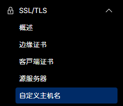

## CDN优选

回到DNS处

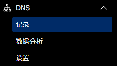

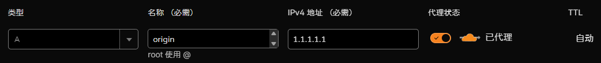

### 源站域名

添加一个A记录，指向你的源站的IP，并开启小黄云

| 占位符 | 说明 | 示例 |
| --- | --- | --- |
| `名称` | 可替换为任意字符串 | `origin-1` `ip` |
| `IPv4 地址` | 可替换为你的源站ip | `1.1.1.1` `2.2.2.2` |

### 优选ip域名

再添加一个cname记录，cname到优选域名

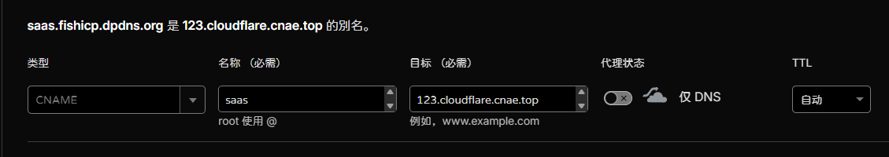

| 占位符 | 说明 | 示例 |
| --- | --- | --- |
| `名称` | 可替换为任意字符串 | `saas` `cdn` |
| `目标` | 可替换为优选域名 | `123.cloudflare.cnae.top` `abc.cloudflare.byoip.top` |

回到自定义主机名

添加回退源，指向你添加的A记录的域名，点击添加回退源

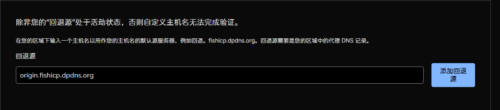

随后点击添加自定义主机名

#### 对于单域名，即回退源和要优选域名的跟域名一致

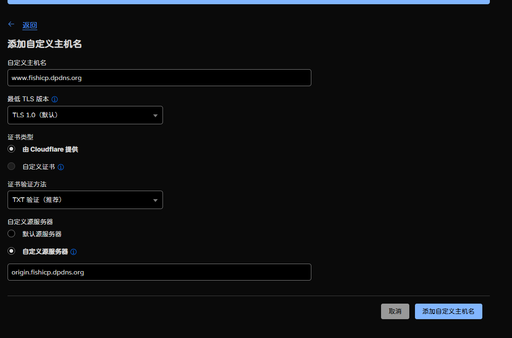

| 占位符 | 说明 | 示例 |
| --- | --- | --- |
| `自定义主机名` | 你要被优选的域名 | `www.fishicp.dpdns.org` |
| `自定义源服务器` | 必须选择自定义源服务器选项，如果有其他源站，可填写其他源站的域名 | `origin.fishicp.dpdns.org` |

其他选项请使用默认值

#### 对于双域名，即回退源和要优选的域名跟域名不一致

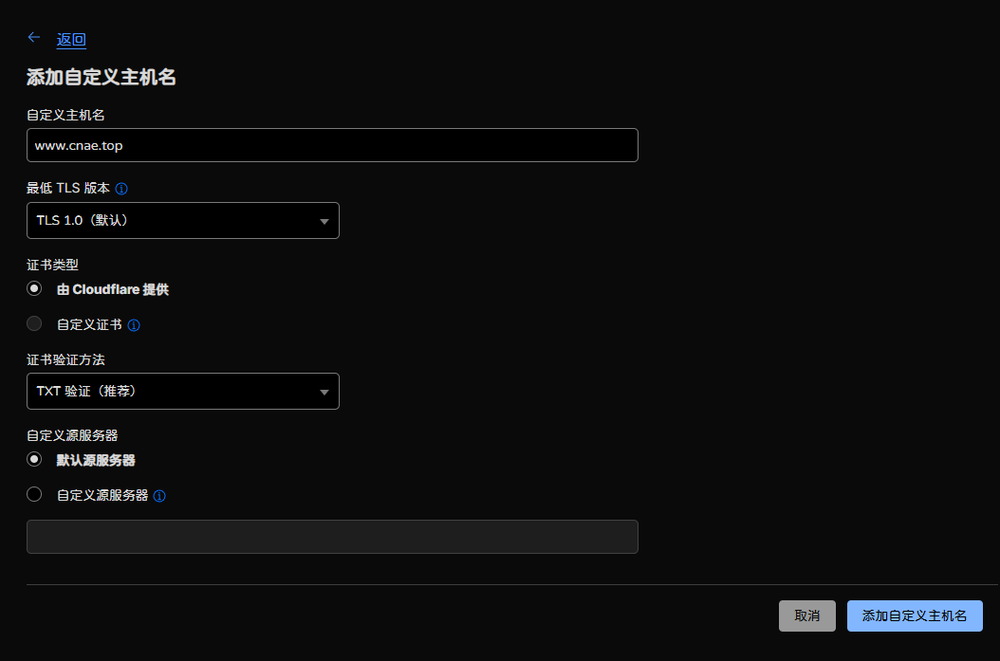

| 占位符 | 说明 | 示例 |
| --- | --- | --- |
| `自定义主机名` | 你要被优选的域名 | `www.cnae.top` |
| `自定义源服务器` | 自定义源服务器选项，如果有其他源站，可填写其他源站的域名 | `origin.fishicp.dpdns.org` |

其他选项请使用默认值

### 优选配置

点击添加自定义主机名(这里以双域名为例)

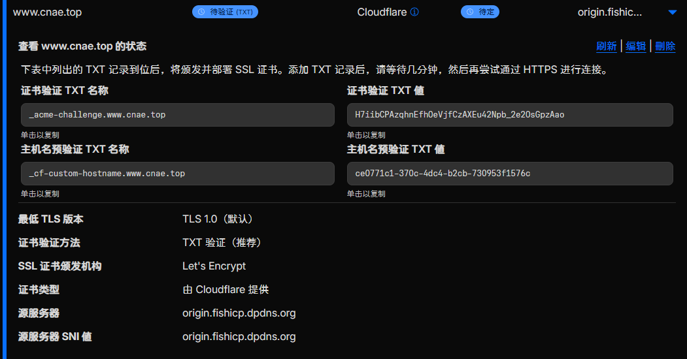

单域名主机名状态正常应会自动验证，如果没有自动验证添加txt记录即可

::: tip
如果dns为cloudflare，则需删除跟域名，仅保留`_cf-custom-hostname.子域名`即可
:::

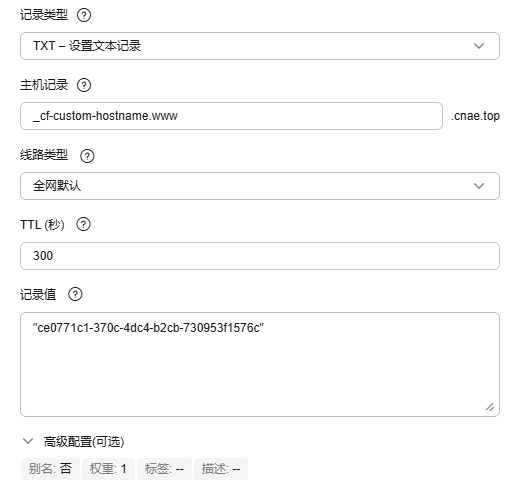

`_cf-custom-hostname.你要优选的域名` txt记录 值为cloudflare提供的txt记录

添加完主机名验证后，继续添加证书验证，如果要证书自动续签，请查看[证书自动续签](#证书自动续签)部分

`_acme-challenge.你要优选的域名` txt记录 值为cloudflare提供的txt记录

::: tip
如果dns为cloudflare，则需删除跟域名，仅保留`_acme-challenge.子域名`即可
:::

最后添加cname记录指向[优选ip域名](#优选ip域名)中的域名即可

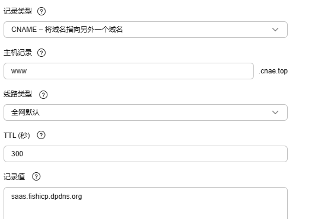

过一会点击刷新按钮，应会显示如下状态

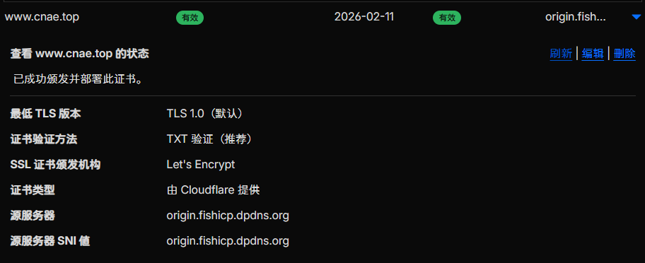

## Pages优选

### 如果你的DNS提供商支持分线路

则默认解析设为`xxx.pages.dev`(你项目分配的默认cname域名)，将中国大陆地区设为`*.cloudflare.cnae.top`

| 占位符 | 说明 | 示例 |
| --- | --- | --- |
| `*` | 可替换为任意字符串 | `myapp.cloudflare.byoip.top` `web.cloudflare.cnae.top` `www.example.com.cloudflare.cnae.top` |

### 如果你的DNS提供商不支持分线路

::: tip
不确定证书是否会自动续签
:::

则将默认分配的`xxx.pages.dev`(你项目分配的默认cname域名)换为`*.cloudflare.cnae.top`

| 占位符 | 说明 | 示例 |
| --- | --- | --- |
| `*` | 可替换为任意字符串 | `myapp.cloudflare.byoip.top` `web.cloudflare.cnae.top` `www.example.com.cloudflare.cnae.top` |

## 证书自动续签

拉倒自定义主机名页面底部，cloudflare会为每个开通自定义主机名的域名提供一个DCV 委派

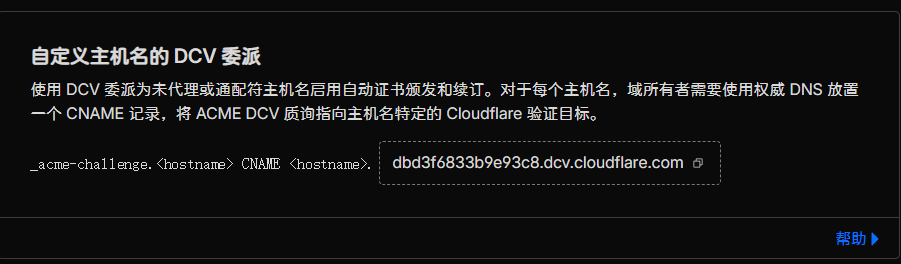

将`_acme-challenge.你要优选的域名`从txt改为cname，并指向DCV 委派分配的域名

::: tip
如果`_acme-challenge.你要优选的域名`添加过txt记录，请删除，否则会影响cname记录的工作
:::

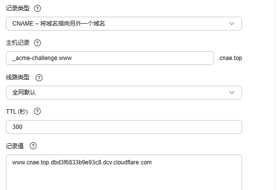

::: tip
www.cnae.top.dbd3f6833b9e93c8.dcv.cloudflare.com这个cname记录仅适用于我的域名 
如果是你的域名应为`被优选域名.cloudflare分配的dcv记录`
:::